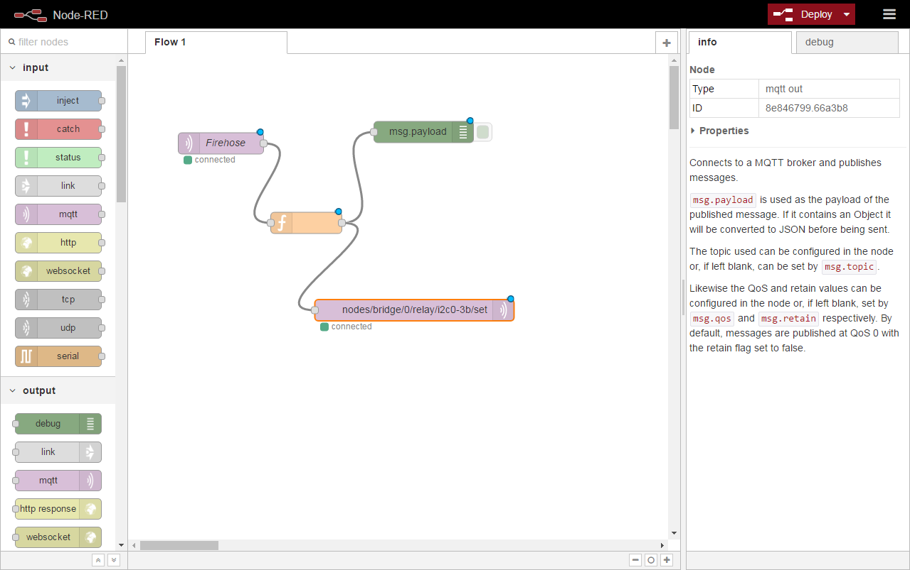
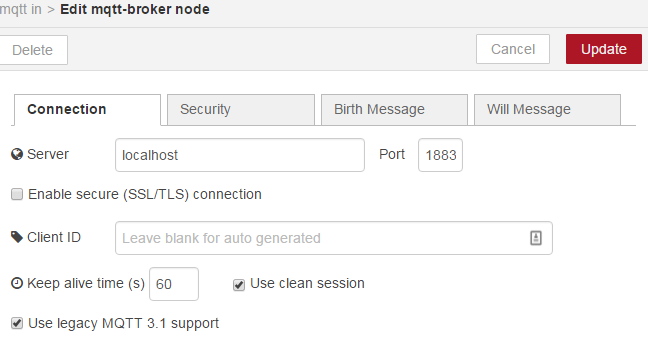
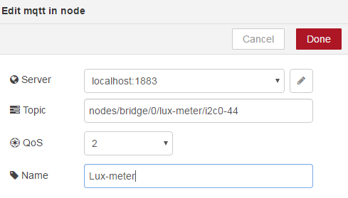
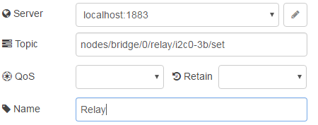
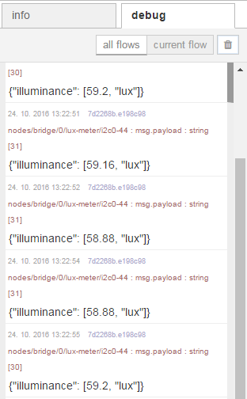
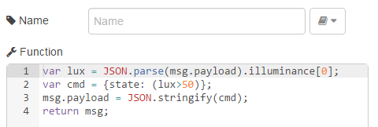
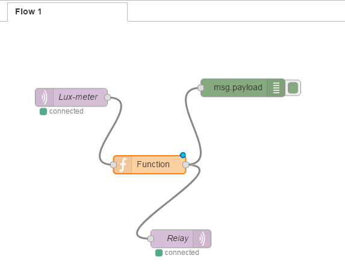

# Node RED - Visual Tool for IoT

To better process data moving through the system we can use the [Node-RED](http://nodered.org) tool.
As indicated by the name, this is an application built on [Node.js](https://nodejs.org) technology.


## Installation

You must first install Node.js if you do not already have it in your system.
Node.js can be run on Windows, Linux or macOS systems.
Follow the instructions on the [Node.js website](https://nodejs.org).

After installing Node.js, make sure it has been installed properly and that it is functional.
Open the console (command line) and enter:

```
node --version
npm --version
```

Both commmands should list the installed version.
To run Node-RED you need at least version 0.10.x, at the time of writing this article it is 6.9.1, and npm of at least version 2.x.

Launch installation of Node-RED with the command:

`sudo npm install -g --unsafe-perm node-red`

This command will install Node-RED as a globally executable tool.

To launch Node-RED, just use the command:

`node-red`

After launching you can open the Node-RED editor at http://localhost:1880


## Installation on Raspberry Pi

Node-RED can also be installed on Raspberry Pi.
If you use Raspberry Pi as a platform to run the Hub, you can install Node-RED on it.
The following procedure has been tested with Raspbian Jessie Lite.

First we prepare the source and repository:

`curl -sL https://deb.nodesource.com/setup_6.x | sudo -E bash -`

Now we install Node.js:

`sudo apt install -y nodejs`

And finally Node-RED itself:

`sudo npm install -g --unsafe-perm node-red`

Raspberry Pi has limited operating memory, that is why Node-RED must be run using the max-old-space-size parameter, which limits the maximum amount of memory used:

`node-red-pi --max-old-space-size=128`

If you want Node-RED to run after every system start, you can prepare a start up script using the following commands:

`sudo wget https://raw.githubusercontent.com/node-red/raspbian-deb-package/master/resources/nodered.service -O /lib/systemd/system/nodered.service`

`sudo wget https://raw.githubusercontent.com/node-red/raspbian-deb-package/master/resources/node-red-start -O /usr/bin/node-red-start`

`sudo wget https://raw.githubusercontent.com/node-red/raspbian-deb-package/master/resources/node-red-stop -O /usr/bin/node-red-stop`

`sudo chmod +x /usr/bin/node-red-st*`

`sudo systemctl daemon-reload`

And then enable autostart with this command:

`sudo systemctl enable nodered.service`


## First steps

Node-RED runs as a web application at http://localhost:1880 (if you are running it on another computer, or on Raspberry, then of course you will not use the localhost, but the address of the remote computer).



Node-RED connects the source of messages and outputs using data lines (pipes), making it possible to define basic operations that can be performed with messages.
This makes it easier to form and operate a system for data collection or automation.
The basic unit for automation is Flow (data flow diagram).

For a source, we might use MQTT, websocket, TCP or UDP socket, a serial port, or maybe even a user button or other Flow, we can read messages from a file, we can monitor GPIO on Raspberry Pi, or our source of messages and events could even be e-mail or Twitter.
Wait!
Relay switching via Twitter?
Why not!

Outputs have roughly the same options as inputs.
Instead of user source data we can use the "debug" console.

We can process data or events, using special functions (written in JavaScript), or we can use pre-set tools like delay (which delays further transmission of the message by a certain amount of time), trigger (a message can trigger another message to be sent after a certain period of time - useful for timers and switches), or split and join, which is able to combine multiple messages into a single message according to defined rules, or conversely, split a complex message into multiple messages.


## Example

Let’s take a look at a simple automation script to switch a relay depending on lighting intensity.
For this we will use the Lux Meter Tag and Relay Module.

First we will define the MQTT source.
Drag and drop into an empty MQTT Input and define its MQTT source.
In our case it will be localhost:1883 (MQTT in Clown.Hub).





Similarly we define the relay output - we use MQTT Output, we change the Topic but the Server remains the same:



To see how data is flowing, for the time being we can add a debugging output to the Flow.
This does not have to be set in any way.
Once added, we create the first data link - drag and drop from the Lux-meter source to the "msg.payload" output (use the small round dots to the left and right).
As soon as you have created the link, click on the large red Deploy button upper right.

In the console on the right we can monitor data flow:



We want the relay to connect at any time when the lighting level exceeds 50 lux.
Now we will add the Function module to the diagram.
This will convert the message from the lux meter in the form `{"illuminance": [51.28, "lux"]}` into a message that will switch the relay: `{"state": true|false}`.

In the function we first convert msg.payload to an object (using `JSON.parse`), we extract a numeric value, based upon which we create a command that is converted to a JSON string and placed back into `msg.payload`:



We connect the input with the Lux-meter, the output with the Relay, and the entire Flow is started with Deploy:



The relay is switched on depending on changing light levels measured by the lux meter.

You have now successfully created your first automated script.
Node-RED makes the creation of such automation much easier.

Don’t forget: after trying it out set the name and password for Node-RED according to [these instructions](http://nodered.org/docs/security).
