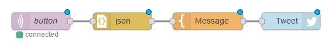
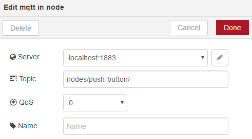
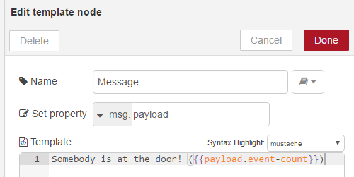
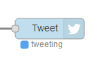
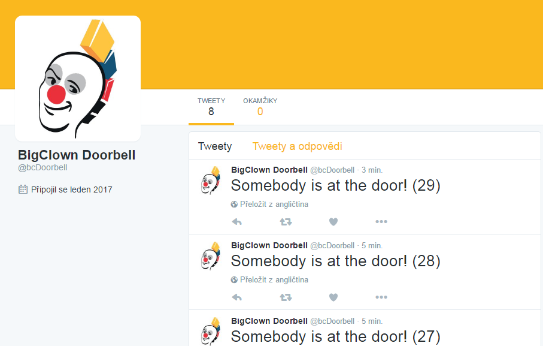
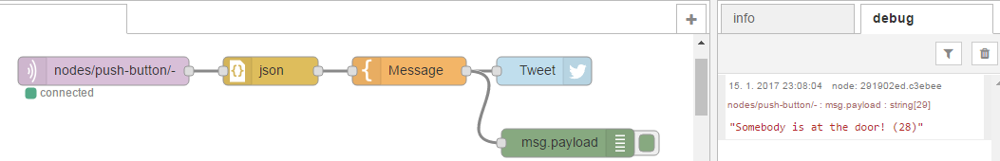

# Tweeting Doorbell Project


<!-- toc -->

## What is it?


This simple example will help you to know BigClown better.
The goal of this project is that a pressed button on the Core Module tweets to the Twitter account. The core module is connected by USB to Raspberry Pi or another computer.
You can monitor your visits and see if you missed someone!

We will use Node-RED to react on MQTT message, then we send the tweet.
[This is an example twitter page](https://twitter.com/bcDoorbell)


## What will we need?


* 1x [Core Module](https://shop.bigclown.com/products/core-module)
* 1x [Raspberry Pi 3](https://shop.bigclown.com/products/raspberry-pi-3-set)
* 1x Micro SD card ([download image](http://doc.bigclown.com/tutorial/install-rpi.html) or [buy the preloaded card](https://shop.bigclown.com/products/apacer-industrial-microsdhc-card-4gb))
* 1x [Micro USB cable](https://shop.bigclown.com/products/usb2-0-cable-am-b-micro-0-6m)


## Core Module


You need to add the code below to your `app/application.c` file.
Because all the logic is handled in the button callback, there's no need to use or create `application_taks()` function.

You can change the button pin to any GPIO if you connect external button to you Core Module. See the [GPIO API page](http://api.bigclown.com/group__bc__gpio.html).

``` c
// LED instance
bc_led_t led;
// Button instance
bc_button_t button;

// Initialization of application
void application_init(void)
{
    // Init USB
    usb_talk_init();

    // Init button and set event handler
    bc_button_init(&button, BC_GPIO_BUTTON, BC_GPIO_PULL_DOWN, false);
    bc_button_set_event_handler(&button, button_event_handler);

    // Init LED, start blinking after power-up
    bc_led_init(&led, BC_GPIO_LED, false, false);
    bc_led_set_mode(&led, BC_LED_MODE_BLINK);
}

void button_event_handler(bc_button_t *self, bc_button_event_t event)
{
    // Hide GCC warning of unused variable
    (void) self;

    // When the button is pressed
    if (event == BC_BUTTON_EVENT_PRESS)
    {
        static uint16_t event_count = 0;

        // LED example. Every second press the LED goes on
        bc_led_set_mode(&led, (event_count & 1) != 0 ? BC_LED_MODE_ON : BC_LED_MODE_OFF);

        // Publish USB talk message, this will create MQTT message in computer
        usb_talk_publish_push_button("", &event_count);

        // Count how many times the button is pressed
        event_count++;
    }
}

```

Compile the example by `make`. Then upload the compiled program by J-link [Ozone debugger](http://doc.bigclown.com/tutorial/core-module.html#_j_link_ozone_debugger) by `make ozone` or upload binary over [internal USB DFU bootloader ](http://doc.bigclown.com/tutorial/core-module.html).

After you upload the code, you can test MQTT messages with mosquitto. Change the xxx letters to your Raspberry Pi address. If you run mosquitto directly from Raspberry, you don't have to pass the `-h` parameter.

`mosquitto_sub.exe -h xxx.xxx.xxx.xxx -t # -v`

You should see incoming message when you press the button

`nodes/push-button/- {"event-count": 5}`

## Raspberry Pi configuration

### Installing and configuration

To get the Raspberry Pi working please [follow this Raspberry Pi installation tutorial](http://doc.bigclown.com/tutorial/install-rpi.html). Connect to Rpi shell directly or by SSH.
You need the BigClown Raspberry Pi image because it contains the service to talk to Core module and MQTT.

Then we will need Node-RED to connect MQTT message from the button to the Twitter message. Please follow this [tutorial how to install and configure Node RED](http://doc.bigclown.com/tutorial/node-red.html)

## Node RED configuration

If you configured and started your Node RED, open browser on <raspiAddress>:1880 and create the flow you see below:

* MQTT in block
* JSON block
* Message block
* Twitter out block



You can also import the saved Node RED json below. Then you can skip the next steps explaining how to setup each block.

```json
[{"id":"4f1ddaf2.8d8ff4","type":"tab","label":"Flow 1"},{"id":"3adfde65.667022","type":"mqtt-broker","z":"","broker":"localhost","port":"1883","clientid":"","usetls":false,"compatmode":true,"keepalive":"60","cleansession":true,"willTopic":"","willQos":"0","willPayload":"","birthTopic":"","birthQos":"0","birthPayload":""},{"id":"856fe615.8f1008","type":"twitter-credentials","z":"","screen_name":"@bcDoorbell"},{"id":"b9060d89.926bd","type":"mqtt in","z":"4f1ddaf2.8d8ff4","name":"","topic":"nodes/push-button/-","qos":"0","broker":"3adfde65.667022","x":275,"y":133,"wires":[["aab295ba.d087e8"]]},{"id":"1eb962d4.06a4ad","type":"twitter out","z":"4f1ddaf2.8d8ff4","twitter":"856fe615.8f1008","name":"Tweet","x":739,"y":133,"wires":[]},{"id":"62d4fc7.ea3b104","type":"template","z":"4f1ddaf2.8d8ff4","name":"Message","field":"payload","fieldType":"msg","format":"handlebars","syntax":"mustache","template":"Somebody is at the door! ({{payload.event-count}})","x":597,"y":133,"wires":[["1eb962d4.06a4ad"]]},{"id":"aab295ba.d087e8","type":"json","z":"4f1ddaf2.8d8ff4","name":"","x":451,"y":133,"wires":[["62d4fc7.ea3b104"]]}]
```

### MQTT in block
This block connects to the MQTT broker and listens for the messages. Set the correct server address and topic.



### JSON block
No configuration there

### Message block
This block transforms MQTT message into the text for Twitter.



### Twitter block
You will need to set the Twitter block to your credentials.


## Testing

Now you press `Deploy` in the top right corner. When you press the Core Module button you should see `tweeting` text near the Tweet block for a fraction of the second.



Congratulations! You've made a new project.



## Debugging

In case something is not working. You can use Debug block and connect it somewhere in the chain. Then deploy the flow again, make sure that the green flag on the block is on and switch to the debug output tab on the right panel.


